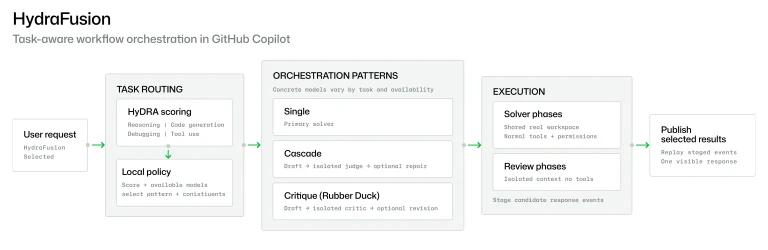

Durante os últimos anos, produtividade com IA se resumia a uma pergunta: qual é o melhor modelo?

Em 2026, essa pergunta ficou cara. E, pior, ficou errada.

Os navegadores portugueses batizaram a ponta sul da África de Cabo das Tormentas. Só depois de aprenderem a atravessá-la com rota, preparo e disciplina, alguém teve coragem de rebatizá-la de Cabo da Boa Esperança.

Em Os Lusíadas, Camões colocou um gigante ali, o Adamastor, pra lembrar que a tempestade não se vence no tamanho do navio.

Com IA está acontecendo o mesmo. O gargalo saiu da inteligência do modelo, a nau maior, o motor mais forte, e foi parar na engenharia ao redor dele: a rota, o preparo, a disciplina de quem atravessa.

E nenhum modelo novo, por melhor que seja, vai te salvar disso.

## Casa de ferreiro, espeto de pau

Quando uma empresa de IA não consegue controlar a escalada de custos dentro de casa, você sabe que temos um problema.

OpenAI publicou um post no último dia 6/set <a href="#ref-1">[1]</a> explicando como seus pesquisadores têm aumentado o uso de IA em suas pesquisas e, por consequência, seus custos.

<blockquote class="excerpt">
<p>Researchers are using coding agents throughout the day (often in concurrent sessions) and total usage is rapidly increasing, outpacing growth among other OpenAI teams.</p>
<cite>OpenAI <a href="#ref-1">[1]</a></cite>
</blockquote>

Eles chamam isso de `automated AI research`.

Como uma imagem vale mais do que mil palavras, observe o problema:

<figure class="chart">
  <svg viewBox="0 0 760 450" role="img" aria-labelledby="c1t c1d">
    <title id="c1t">Custo diário de inference por pesquisador da OpenAI, jan–ago 2026</title>
    <desc id="c1d">A curva fica praticamente rente a zero de janeiro a abril, sobe devagar em maio, estabiliza em torno de US$150 por dia entre o fim de junho e meados de julho e então dispara quase na vertical até cerca de US$600 por dia em meados de agosto.</desc>
    <defs>
      <linearGradient id="chartFade" x1="0" y1="0" x2="0" y2="1">
        <stop offset="0%" stop-color="var(--accent)" stop-opacity="0.22" />
        <stop offset="100%" stop-color="var(--accent)" stop-opacity="0" />
      </linearGradient>
    </defs>
    <text class="chart__axis" x="92" y="30">US$ / dia por pesquisador</text><text class="chart__axis" x="730" y="30" text-anchor="end">2026</text>
    <rect class="chart__band" x="641.3" y="78" width="88.7" height="278" />
    <line class="chart__grid" x1="92" y1="276.6" x2="730" y2="276.6" />
    <line class="chart__grid" x1="92" y1="197.1" x2="730" y2="197.1" />
    <line class="chart__grid" x1="92" y1="117.7" x2="730" y2="117.7" />
    <line class="chart__frame" x1="92" y1="356" x2="730" y2="356" />
    <text class="chart__tick" x="74" y="361" text-anchor="end">0</text>
    <text class="chart__tick" x="74" y="281.6" text-anchor="end">200</text>
    <text class="chart__tick" x="74" y="202.1" text-anchor="end">400</text>
    <text class="chart__tick" x="74" y="122.7" text-anchor="end">600</text>
    <text class="chart__tick" x="180.7" y="390" text-anchor="middle">Fev</text>
    <text class="chart__tick" x="349.5" y="390" text-anchor="middle">Abr</text>
    <text class="chart__tick" x="524" y="390" text-anchor="middle">Jun</text>
    <text class="chart__tick" x="698.5" y="390" text-anchor="middle">Ago</text>
    <polygon class="chart__area" points="92,356 92,355.6 132.1,355.6 180.7,355.2 220.7,354.4 252.2,355.6 260.8,354 300.9,351.2 332.3,351.6 349.5,350 389.5,347.3 418.2,343.3 432.5,338.5 446.8,337.7 475.4,331.4 489.7,327 509.7,323 521.1,324.2 535.5,315.1 555.5,301.2 584.1,291.7 612.7,295.6 641.3,291.3 698.5,204.3 712.8,183.6 730,117.7 730,356" />
    <polyline class="chart__line" points="92,355.6 132.1,355.6 180.7,355.2 220.7,354.4 252.2,355.6 260.8,354 300.9,351.2 332.3,351.6 349.5,350 389.5,347.3 418.2,343.3 432.5,338.5 446.8,337.7 475.4,331.4 489.7,327 509.7,323 521.1,324.2 535.5,315.1 555.5,301.2 584.1,291.7 612.7,295.6 641.3,291.3 698.5,204.3 712.8,183.6 730,117.7" />
    <line class="chart__leader" x1="641.3" y1="282" x2="641.3" y2="252" />
    <text class="chart__note" x="630" y="246" text-anchor="end">platô de ~US$150</text>
    <circle class="chart__dot" cx="641.3" cy="291.3" r="4.5" />
    <circle class="chart__dot" cx="730" cy="117.7" r="5" />
    <text class="chart__value" x="716" y="104" text-anchor="end">US$600 / dia</text>
    <text class="chart__note" x="716" y="148" text-anchor="end">3,7× em um mês</text>
  </svg>
  <figcaption>Custo diário de inference do pesquisador mediano. Redesenhado a partir dos dados de OpenAI <a href="#ref-1">[1]</a></figcaption>
</figure>

Pra ficar claro: pesquisadores medianos consumindo **mais de US$600/dia** em inference no fim de agosto (vs. ~US$150 meses antes);

Dado a aceleração em julho, meu palpite é que os pesquisadores tiveram acesso a um modelo de fronteira (Astra?) e que, com isso, o custo deles explodiu.

Eu sei, você pode argumentar que eles estão atrás da AGI (que já chamam de Recursive Self-improvement, RSI) e que, portanto, o pioneirismo tem seu preço.

E que preço.

Eles também publicaram um número interessante: o crescimento no número de experimentos ativos que cada pesquisador tem trabalhado:

<figure class="chart">
  <svg viewBox="0 0 760 450" role="img" aria-labelledby="c2t c2d">
    <title id="c2t">Experimentos por pesquisador ativo na OpenAI, jan–ago 2026, normalizado em 2025 = 1×</title>
    <desc id="c2d">A série semanal parte de 0,72× em janeiro, cruza a linha de 2025 em março, atinge um platô de 1,38× entre o fim de maio e meados de junho, recua para 1,27× em julho e termina em 1,61× em agosto — cerca de 2,2× o ponto de partida em oito meses.</desc>
    <defs>
      <linearGradient id="chartFade2" x1="0" y1="0" x2="0" y2="1">
        <stop offset="0%" stop-color="var(--accent)" stop-opacity="0.18" />
        <stop offset="100%" stop-color="var(--accent)" stop-opacity="0" />
      </linearGradient>
    </defs>
    <text class="chart__axis" x="92" y="30">Experimentos / pesquisador</text><text class="chart__axis" x="730" y="30" text-anchor="end">semanal</text>
    <line class="chart__grid" x1="92" y1="278.8" x2="730" y2="278.8" />
    <line class="chart__grid" x1="92" y1="124.3" x2="730" y2="124.3" />
    <line class="chart__frame" x1="92" y1="356" x2="730" y2="356" />
    <line class="chart__ref" x1="92" y1="201.6" x2="730" y2="201.6" />
    <text class="chart__reflabel" x="92" y="195">base 2025 = 1&#215;</text>
    <text class="chart__tick" x="74" y="361" text-anchor="end">0</text>
    <text class="chart__tick" x="74" y="283.8" text-anchor="end">0,5&#215;</text>
    <text class="chart__tick" x="74" y="206.6" text-anchor="end">1,0&#215;</text>
    <text class="chart__tick" x="74" y="129.3" text-anchor="end">1,5&#215;</text>
    <text class="chart__tick" x="174.3" y="390" text-anchor="middle">Fev</text>
    <text class="chart__tick" x="339" y="390" text-anchor="middle">Abr</text>
    <text class="chart__tick" x="503.6" y="390" text-anchor="middle">Jun</text>
    <text class="chart__tick" x="668.3" y="390" text-anchor="middle">Ago</text>
    <polygon class="chart__area chart__area--alt" points="92,356 92.0,244.8 112.6,246.3 133.2,246.3 153.7,224.7 174.3,220.1 194.9,213.9 215.5,213.9 236.1,210.8 256.6,204.6 277.2,203.1 297.8,201.6 318.4,198.5 339.0,192.3 359.5,193.8 380.1,195.4 400.7,184.6 421.3,172.2 441.9,152.1 462.5,155.2 483.0,142.9 503.6,142.9 524.2,142.9 544.8,147.5 565.4,153.7 585.9,150.6 606.5,152.1 627.1,159.9 647.7,146.0 668.3,130.5 688.8,116.6 709.4,107.3 730.0,107.3 730,356" />
    <polyline class="chart__line" points="92.0,244.8 112.6,246.3 133.2,246.3 153.7,224.7 174.3,220.1 194.9,213.9 215.5,213.9 236.1,210.8 256.6,204.6 277.2,203.1 297.8,201.6 318.4,198.5 339.0,192.3 359.5,193.8 380.1,195.4 400.7,184.6 421.3,172.2 441.9,152.1 462.5,155.2 483.0,142.9 503.6,142.9 524.2,142.9 544.8,147.5 565.4,153.7 585.9,150.6 606.5,152.1 627.1,159.9 647.7,146.0 668.3,130.5 688.8,116.6 709.4,107.3 730.0,107.3" />
    <circle class="chart__mark" cx="92.0" cy="244.8" r="3.2" /><circle class="chart__mark" cx="112.6" cy="246.3" r="3.2" /><circle class="chart__mark" cx="133.2" cy="246.3" r="3.2" /><circle class="chart__mark" cx="153.7" cy="224.7" r="3.2" /><circle class="chart__mark" cx="174.3" cy="220.1" r="3.2" /><circle class="chart__mark" cx="194.9" cy="213.9" r="3.2" /><circle class="chart__mark" cx="215.5" cy="213.9" r="3.2" /><circle class="chart__mark" cx="236.1" cy="210.8" r="3.2" /><circle class="chart__mark" cx="256.6" cy="204.6" r="3.2" /><circle class="chart__mark" cx="277.2" cy="203.1" r="3.2" /><circle class="chart__mark" cx="297.8" cy="201.6" r="3.2" /><circle class="chart__mark" cx="318.4" cy="198.5" r="3.2" /><circle class="chart__mark" cx="339.0" cy="192.3" r="3.2" /><circle class="chart__mark" cx="359.5" cy="193.8" r="3.2" /><circle class="chart__mark" cx="380.1" cy="195.4" r="3.2" /><circle class="chart__mark" cx="400.7" cy="184.6" r="3.2" /><circle class="chart__mark" cx="421.3" cy="172.2" r="3.2" /><circle class="chart__mark" cx="441.9" cy="152.1" r="3.2" /><circle class="chart__mark" cx="462.5" cy="155.2" r="3.2" /><circle class="chart__mark" cx="483.0" cy="142.9" r="3.2" /><circle class="chart__mark" cx="503.6" cy="142.9" r="3.2" /><circle class="chart__mark" cx="524.2" cy="142.9" r="3.2" /><circle class="chart__mark" cx="544.8" cy="147.5" r="3.2" /><circle class="chart__mark" cx="565.4" cy="153.7" r="3.2" /><circle class="chart__mark" cx="585.9" cy="150.6" r="3.2" /><circle class="chart__mark" cx="606.5" cy="152.1" r="3.2" /><circle class="chart__mark" cx="627.1" cy="159.9" r="3.2" /><circle class="chart__mark" cx="647.7" cy="146.0" r="3.2" /><circle class="chart__mark" cx="668.3" cy="130.5" r="3.2" /><circle class="chart__mark" cx="688.8" cy="116.6" r="3.2" /><circle class="chart__mark" cx="709.4" cy="107.3" r="3.2" /><circle class="chart__mark" cx="730.0" cy="107.3" r="3.2" />
    <line class="chart__leader" x1="503.6" y1="133" x2="503.6" y2="103" />
    <text class="chart__note" x="492" y="97" text-anchor="end">plat&#244; de 1,38&#215;</text>
    <circle class="chart__dot" cx="730" cy="107.3" r="5" />
    <text class="chart__value" x="714" y="88" text-anchor="end">1,61&#215;</text>
  </svg>
  <figcaption>Experimentos por pesquisador ativo, amostragem semanal. Eixo a partir de zero, ao contrário do original. Redesenhado a partir dos dados de OpenAI <a href="#ref-1">[1]</a></figcaption>
</figure>

Sem dúvidas, um crescimento importante. Agora vamos colocar em escala, em relação ao primeiro chart, o de custos:

<figure class="chart">
  <svg viewBox="0 0 760 450" role="img" aria-labelledby="c3t c3d">
    <title id="c3t">Custo de inference contra volume de experimentos, ambos indexados em 1&#215; em abril de 2026, escala logar&#237;tmica</title>
    <desc id="c3d">Partindo da mesma base em abril, o custo diário por pesquisador chega a cerca de 40 vezes o valor inicial em meados de agosto, enquanto o número de experimentos por pesquisador chega a 1,5 vez. Em escala logarítmica as duas curvas partem do mesmo ponto e divergem de forma acentuada.</desc>
    <text class="chart__axis" x="92" y="30">Crescimento desde abril &#183; escala log</text><text class="chart__axis" x="730" y="30" text-anchor="end">2026</text>
    <line class="chart__grid" x1="92" y1="267.1" x2="730" y2="267.1" />
    <line class="chart__grid" x1="92" y1="186.2" x2="730" y2="186.2" />
    <line class="chart__grid" x1="92" y1="112.3" x2="730" y2="112.3" />
    <line class="chart__frame" x1="92" y1="356" x2="730" y2="356" />
    <line class="chart__ref" x1="92" y1="341" x2="730" y2="341" />
    <text class="chart__tick" x="74" y="346" text-anchor="end">1&#215;</text>
    <text class="chart__tick" x="74" y="272.1" text-anchor="end">3&#215;</text>
    <text class="chart__tick" x="74" y="191.2" text-anchor="end">10&#215;</text>
    <text class="chart__tick" x="74" y="117.3" text-anchor="end">30&#215;</text>
    <text class="chart__tick" x="92.0" y="390" text-anchor="middle">Abr</text>
    <text class="chart__tick" x="235.9" y="390" text-anchor="middle">Mai</text>
    <text class="chart__tick" x="384.6" y="390" text-anchor="middle">Jun</text>
    <text class="chart__tick" x="528.5" y="390" text-anchor="middle">Jul</text>
    <text class="chart__tick" x="677.2" y="390" text-anchor="middle">Ago</text>
    <polyline class="chart__line chart__line--b" points="92.0,341.0 125.6,341.6 159.2,342.3 192.7,337.9 226.3,333.2 259.9,326.3 293.5,327.3 327.1,323.3 360.6,323.3 394.2,323.3 427.8,324.7 461.4,326.8 494.9,325.7 528.5,326.3 562.1,328.8 595.7,324.2 629.3,319.5 662.8,315.5 696.4,312.9 730.0,312.9" />
    <circle class="chart__mark chart__mark--b" cx="92.0" cy="341.0" r="3" /><circle class="chart__mark chart__mark--b" cx="125.6" cy="341.6" r="3" /><circle class="chart__mark chart__mark--b" cx="159.2" cy="342.3" r="3" /><circle class="chart__mark chart__mark--b" cx="192.7" cy="337.9" r="3" /><circle class="chart__mark chart__mark--b" cx="226.3" cy="333.2" r="3" /><circle class="chart__mark chart__mark--b" cx="259.9" cy="326.3" r="3" /><circle class="chart__mark chart__mark--b" cx="293.5" cy="327.3" r="3" /><circle class="chart__mark chart__mark--b" cx="327.1" cy="323.3" r="3" /><circle class="chart__mark chart__mark--b" cx="360.6" cy="323.3" r="3" /><circle class="chart__mark chart__mark--b" cx="394.2" cy="323.3" r="3" /><circle class="chart__mark chart__mark--b" cx="427.8" cy="324.7" r="3" /><circle class="chart__mark chart__mark--b" cx="461.4" cy="326.8" r="3" /><circle class="chart__mark chart__mark--b" cx="494.9" cy="325.7" r="3" /><circle class="chart__mark chart__mark--b" cx="528.5" cy="326.3" r="3" /><circle class="chart__mark chart__mark--b" cx="562.1" cy="328.8" r="3" /><circle class="chart__mark chart__mark--b" cx="595.7" cy="324.2" r="3" /><circle class="chart__mark chart__mark--b" cx="629.3" cy="319.5" r="3" /><circle class="chart__mark chart__mark--b" cx="662.8" cy="315.5" r="3" /><circle class="chart__mark chart__mark--b" cx="696.4" cy="312.9" r="3" /><circle class="chart__mark chart__mark--b" cx="730.0" cy="312.9" r="3" />
    <polyline class="chart__line" points="92.0,341.0 159.2,315.3 207.1,290.1 231.1,268.7 255.1,265.7 303.1,245.6 327.1,234.6 360.6,226.0 379.8,228.5 403.8,211.5 437.4,191.8 485.4,181.0 533.3,185.3 581.3,180.6 677.2,123.4 701.2,114.8 730.0,93.0" />
    <circle class="chart__dot" cx="730" cy="93" r="5" />
    <text class="chart__value" x="714" y="80" text-anchor="end">40&#215;</text>
    <circle class="chart__dot chart__dot--b" cx="730" cy="312.9" r="5" />
    <text class="chart__value chart__value--b" x="714" y="303" text-anchor="end">1,5&#215;</text>
    <text class="chart__note" x="714" y="129" text-anchor="end">o custo subiu 26&#215; mais r&#225;pido</text>
    <line class="chart__swatch" x1="92" y1="424" x2="118" y2="424" /><text class="chart__key" x="126" y="428">Custo / dia</text>
    <line class="chart__swatch chart__swatch--b" x1="496" y1="424" x2="522" y2="424" /><text class="chart__key chart__key--b" x="530" y="428">Experimentos</text>
  </svg>
  <figcaption>Custo e volume de experimentos, ambos indexados em 1× em 1/abr. Escala logarítmica: partindo do mesmo ponto, o que se compara é a inclinação. Base em abril, e não em janeiro, porque o custo de janeiro (~US$1/dia) é pequeno demais para servir de denominador. Redesenhado a partir dos dados de OpenAI <a href="#ref-1">[1]</a></figcaption>
</figure>

Mas mesmo assim, como diria Warren Buffett: "Preço é o que você paga, valor é o que você tem".

## A virada: o modelo deixou de ser a resposta

Se nem quem fabrica os modelos controla o custo de usá-los, a saída parou de ser "esperar o próximo modelo". O modelo intermediário de hoje foi o modelo de fronteira ontem. E seus custos também.

**O gargalo da engenharia de software com IA está deixando de ser inteligência e passando a ser arquitetura de workflow no processo de desenvolvimento.**

> **The gap between what today's models can do and what you see them doing is largely a harness gap.**
>
> <cite>Addy Osmani <a href="#ref-5">[5]</a></cite>

O caminho para a balança entre custo vs qualidade, na minha mente, passa pela escolha inteligente de modelos + um bom harness.

## Deixe a máquina escolher a máquina

Você poderia argumentar: "então é só o dev escolher o modelo barato quando dá."

Na prática, isso não escala. Cada decisão de "qual modelo agora?" é uma troca de tarefa. E troca de tarefa tem custo mensurável de tempo e erro.

O dev que fica micro-otimizando modelo para economizar centavos de inference está gastando o recurso mais caro da sala: a própria atenção. É falsa economia. Não é trabalho de humano. É trabalho que precisa ser automatizado.

Como resposta disso, há um crescimento nos mecanismos de escolha inteligente de modelos, que tentam identificar dinamicamente a natureza e a complexidade das tarefas e, assim, escolher o modelo que forneça a melhor qualidade com o menor preço.

Algumas opções:

- RouteLLM <a href="#ref-6">[6]</a>
- OpenRouter AutoRouter <a href="#ref-7">[7]</a>
- Copilot HydraFusion <a href="#ref-2">[2]</a>

Nesta última semana, tenho testado o Copilot HydraFusion <a href="#ref-2">[2]</a>. Embora ainda experimental, os resultados têm sido satisfatórios: bons outputs, custo razoável.

Em vez de o desenvolvedor escolher simplesmente "o melhor modelo", o runtime decide entre os padrões **single, cascade e critique**, combinando modelos diferentes conforme o problema.

<figure>
  
  <figcaption>Os padrões single, cascade e critique. Fonte: GitHub <a href="#ref-2">[2]</a></figcaption>
</figure>

Nos testes deles, houve uma redução de mais de 60% do custo, se comparado ao uso contínuo do Opus 5. No meu uso limitado durante testes, estimo uma economia mais tímida, algo entre 20 a 30%.

Porém, há um aumento de latência nos prompts, dado que a orquestração adaptativa tem seu preço: o tempo de decisão agora aparece em cada execução.

<figure class="flow">
  <div class="flow__grid">
    <div class="flow__col">
      <p class="flow__head">Antes</p>
      <ol class="flow__chain">
      <li><span class="flow__node">Problema</span></li>
      <li><span class="flow__node">Escolher modelo</span></li>
      <li><span class="flow__node">Prompt</span></li>
      <li><span class="flow__node">Resposta</span></li>
      </ol>
    </div>
    <div class="flow__col flow__col--now">
      <p class="flow__head">Agora</p>
      <ol class="flow__chain">
      <li><span class="flow__node">Problema</span></li>
      <li><span class="flow__node">Classificação</span></li>
        <li>
          <div class="flow__node flow__node--hub">
            <span class="flow__hub">Workflow</span>
            <ul class="flow__fan"><li>modelo barato</li><li>modelo forte</li><li>paralelo</li><li>crítico</li><li>memória</li><li>ferramentas</li><li>retry</li><li>sandbox</li><li>verificação</li></ul>
          </div>
        </li>
      <li><span class="flow__node">Resultado</span></li>
      </ol>
    </div>
  </div>
</figure>

<!-- [nota] Fecho de transição para o harness: routing otimiza QUAL modelo roda; harness otimiza o AMBIENTE em que ele roda. Uma frase aqui liga as duas frentes. -->

## Harness: foco no ambiente, não o modelo

Harness não é só confiabilidade. Um agente trabalhando de forma errada significa tokens queimados, retrabalho e tempo de review. Disciplina aqui gera economia.

<figure class="layers">
  <div class="layers__ring layers__ring--harness"><p class="layers__name">Harness</p><ul class="layers__tags"><li>API</li><li>Memória</li><li>Ferramentas</li><li>Sandbox</li><li>Guardrails</li><li>Monitoramento</li><li>Orquestração</li><li>CI/CD</li><li>Logging</li></ul><div class="layers__ring layers__ring--context"><p class="layers__name">Contexto</p><ul class="layers__tags"><li>Histórico da conversa</li><li>Dados recuperados</li><li>Turnos anteriores</li><li>Base de conhecimento</li><li>Documentos</li></ul><div class="layers__ring layers__ring--prompt"><p class="layers__name">Prompt</p><ul class="layers__tags"><li>Instrução</li><li>Papel</li><li>Tom</li><li>Few-shot</li></ul><div class="layers__core">Modelo</div></div></div></div>
  <figcaption>O modelo no núcleo, e cada camada que o envolve. Redesenhado a partir do diagrama de Birgitta Böckeler <a href="#ref-3">[3]</a></figcaption>
</figure>

**Um bom harness constrói o ambiente no qual o agente consegue executar trabalho confiável.**

Isso não elimina todos os problemas, mas cria um processo.

> **A decent model with a great harness beats a great model with a bad harness.**
>
> <cite>Addy Osmani <a href="#ref-5">[5]</a></cite>

### O caso Codex

Para além da definição formal, a OpenAI publicou um excelente artigo sobre a construção de um time agêntico (agent-only) e documentou o processo em seu post "Harness engineering: leveraging Codex in an agent-first world" <a href="#ref-4">[4]</a>.

O mais importante é a sinceridade deles ao admitir: no início, o processo é mais lento.

<blockquote class="excerpt">
<p>Early progress was slower than we expected</p>
<cite>OpenAI <a href="#ref-4">[4]</a></cite>
</blockquote>

E, na minha percepção nos meus times, isso é verdade, em especial em projetos criados antes desta era de IA e agentes.

Contexto, guardrails, quality gates, intenções de entrega, padrões de codificação, design, processo de review, testes... definir isso tudo leva tempo.

<!-- [nota] Aqui está seu diferencial de eixo (IA em legado/escala): o custo inicial da disciplina em bases antigas. Aprofunde COM EXEMPLO SEU, não só citando a OpenAI. -->

No fim, eles construíram uma miríade de `.md`s contendo todo o harness necessário para a aplicação:

```
AGENTS.md
ARCHITECTURE.md
docs/
├── design-docs/
│   ├── index.md
│   ├── core-beliefs.md
│   └── ...
├── exec-plans/
│   ├── active/
│   ├── completed/
│   └── tech-debt-tracker.md
├── generated/
│   └── db-schema.md
├── product-specs/
│   ├── index.md
│   ├── new-user-onboarding.md
│   └── ...
├── references/
│   ├── design-system-reference-llms.txt
│   ├── nixpacks-llms.txt
│   ├── uv-llms.txt
│   └── ...
├── DESIGN.md
├── FRONTEND.md
├── PLANS.md
├── PRODUCT_SENSE.md
├── QUALITY_SCORE.md
├── RELIABILITY.md
└── SECURITY.md
```

É importante lembrar que nem todos os projetos precisam de tantas especificações. O padrão deles não deve ser automaticamente o seu. Nem o meu.

### E o humano, onde entra?

Não é "simplesmente codar", com certeza. Até mesmo o processo de review de Merge/Pull Requests, segundo a OpenAI, ficou menos "exclusivo" aos humanos.

O humano continua no loop. Não por empatia, mas por necessidade. Deixar tudo na mão dos agentes traz um mundo de novos problemas.

<blockquote class="excerpt">
<p>We're still learning where human judgment adds the most leverage and how to encode that judgment so it compounds.</p>
<p class="elision">(&hellip;)</p>
<p>Our most difficult challenges now center on designing environments, feedback loops, and control systems that help agents accomplish our goal: build and maintain complex, reliable software at scale.</p>
<cite>OpenAI <a href="#ref-4">[4]</a></cite>
</blockquote>

## O diferencial mudou de lugar

Voltemos ao começo.

Nem a OpenAI, que fabrica os modelos, consegue evitar a escalada dos custos. Esperar o próximo resolver isso é ingenuidade. O modelo deixou de ser o gargalo, o ambiente em volta dele é que é.

Routing decide qual modelo roda, harness decide em que condições, duas faces da mesma disciplina que morde mais forte em bases de código grandes e antigas, onde legado cobra harness.

A vantagem competitiva parou de ser acesso ao melhor modelo, isso todo mundo com algum dinheiro (e pouco juízo) tem. Passou a ser a capacidade de construir o melhor ambiente pro agente trabalhar.

Modelo virou commodity, workflow virou o diferencial.

<aside class="callout">
<strong>Fontes</strong>
<span id="ref-1">[1]</span> - Research acceleration: a view inside OpenAI - <a href="https://openai.com/index/research-acceleration-view-inside-openai/">https://openai.com/index/research-acceleration-view-inside-openai/</a><br>
<span id="ref-2">[2]</span> - Project HydraFusion: frontier quality via multi-model orchestration - <a href="https://github.blog/ai-and-ml/github-copilot/project-hydrafusion-frontier-quality-via-multi-model-orchestration/">https://github.blog/ai-and-ml/github-copilot/project-hydrafusion-frontier-quality-via-multi-model-orchestration/</a><br>
<span id="ref-3">[3]</span> - Harness engineering for coding agent users - <a href="https://martinfowler.com/articles/harness-engineering.html">https://martinfowler.com/articles/harness-engineering.html</a><br>
<span id="ref-4">[4]</span> - Harness engineering: leveraging Codex in an agent-first world - <a href="https://openai.com/index/harness-engineering/">https://openai.com/index/harness-engineering/</a><br>
<span id="ref-5">[5]</span> - Agent harness engineering - <a href="https://addyosmani.com/blog/agent-harness-engineering/">https://addyosmani.com/blog/agent-harness-engineering/</a><br>
<span id="ref-6">[6]</span> - RouteLLM - <a href="https://github.com/lm-sys/routellm">https://github.com/lm-sys/routellm</a><br>
<span id="ref-7">[7]</span> - OpenRouter AutoRouter - <a href="https://openrouter.ai/docs/guides/routing/routers/auto-router">https://openrouter.ai/docs/guides/routing/routers/auto-router</a>
</aside>
